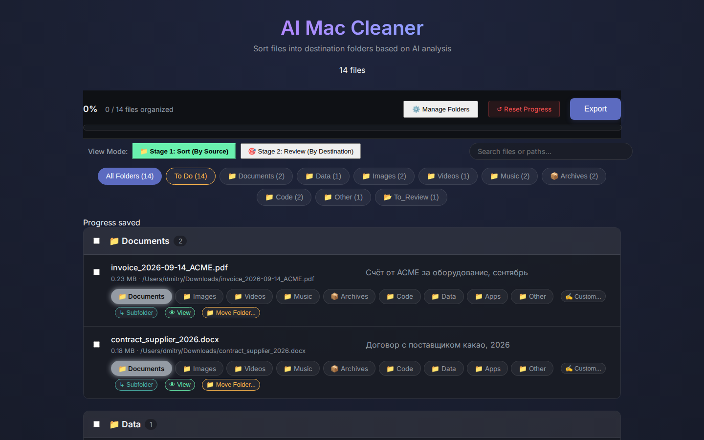
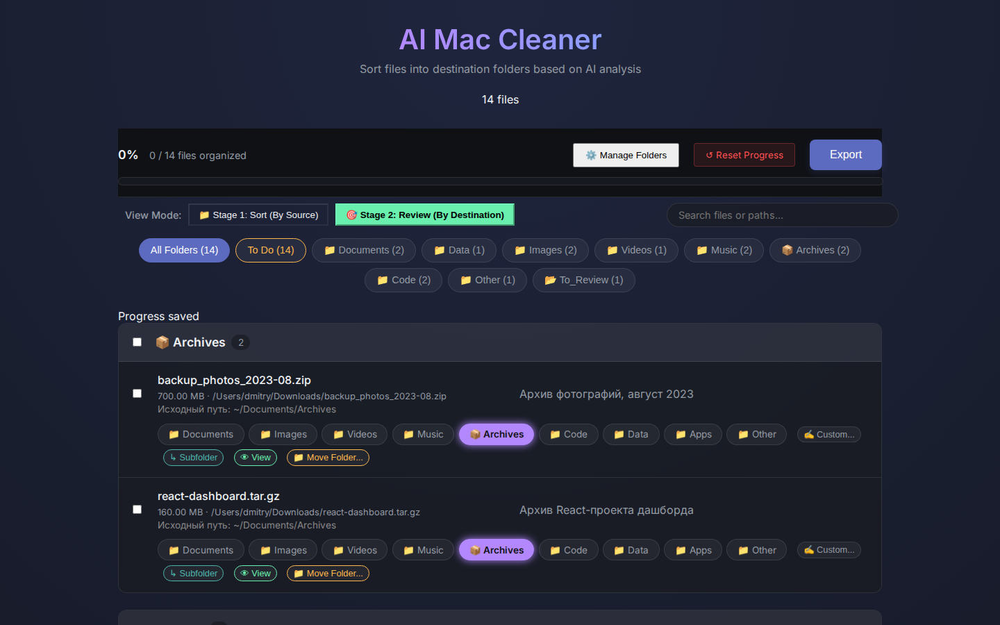

<div align="center">

# 🧹 AI File Cleaner

**AI-driven file organization for macOS, Windows & Linux — review first, move second.**

[](https://github.com/SahCour/AI-File-Cleaner-Cross-Platform/actions/workflows/ci.yml)


</div>

A ridiculously powerful tool for organizing thousands of messy files. Instead of rule-based sorting by extension, **AI File Cleaner** uses LLMs to semantically understand what every file *is* — an invoice, a design, a podcast episode — and proposes the perfect destination folder. You review everything in a two-stage web dashboard before a single byte moves.

## 📸 Screenshots

| Stage 1: Review by Source | Stage 2: Review by Destination |
|---|---|
|  |  |

## 🎯 Why AI File Cleaner?

- **Two-Stage Review (unique).** Stage 1 shows the AI's sorting predictions grouped by where files came from; Stage 2 shows the final target folders. You approve at both stages — nothing moves without you.
- **Semantic, not rule-based.** Files are understood by content and purpose, so `invoice_2026.pdf`, `pitch_deck_final.key` and `IMG_8402.jpg` land where they belong — no brittle extension rules.
- **AI descriptions.** Every file gets a human-readable one-line summary, so you can spot junk instantly.
- **Quarantine, not deletion.** Files marked for deletion are moved to a `_Quarantine` folder for manual inspection — never wiped.
- **Lightning-fast web UI.** Handles 5000+ files in the browser without lag. No heavy desktop client needed for review.
- **Fully local.** Files are processed on your machine; the dashboard runs on `127.0.0.1`.
- **Cross-platform.** macOS, Windows and Linux — with platform-aware protections (file locks, aliases, iCloud stubs) on macOS.

## 🔒 Security & Safety

- **Local-only server.** The dashboard binds to `127.0.0.1`, not your LAN.
- **No unapproved moves.** The executor only processes tasks you explicitly export.
- **Open-whitelist.** `/api/open` can only reveal files that are actually in the scan manifest.
- **CSRF guard.** State-changing endpoints validate the `Host` header.
- **Collision handling.** Name clashes get automatic suffixes (`_1`, `_2`) — nothing is silently overwritten.
- **Rollback.** A full move log lets you undo an entire cleanup run if needed.

## 🛠 Prerequisites

- Python 3.9+ (only the standard library — zero dependencies)
- A modern browser (Chrome, Safari, Firefox, Arc)
- An LLM API key for the description/scoring scripts (see `scripts/generate_descriptions.py`)

## 📦 Installation & Usage

```bash
# 1. Index your cluttered folders
python3 scripts/scan_files.py            # → files_to_process.json

# 2. Generate AI descriptions (optional but recommended)
python3 scripts/generate_descriptions.py  # → enriches the manifest

# 3. Launch the review dashboard
python3 webapp/server.py                  # → http://localhost:8002

# 4. Review in Stage 1 → Stage 2 → Export
#    Export writes export_tasks.json to your Downloads folder

# 5. Execute the approved moves
python3 scripts/executor.py               # safely moves everything

# 6. Changed your mind? Roll everything back
python3 rollback.py
```

## 🧪 Tests

12 unit tests covering the executor and rollback engine (`tests/`), run on every push via GitHub Actions against Python 3.9 / 3.11 / 3.12:

```bash
python -m unittest discover -s tests -v
```

## 🗺 Roadmap

- [ ] Native `.dmg` / installer packaging (Tauri / Electron)
- [ ] Built-in file tree browser for custom folder selection
- [ ] Local-LLM integration (Ollama) for 100% offline, private scanning
- [ ] Diff preview of the full move plan before execution
- [ ] Undo history persisted across sessions

## 📄 License

[MIT](LICENSE)

---
*Built to bring order to the chaos. Review first, move second.*